---
This lesson was written in the form of an article to demonstrate FISSURE as an RF reverse engineering tool. Additional Z-Wave information could be added throughout the sections over time.

## Table of Contents
1. [Introduction](#introduction)
2. [Monitoring](#monitoring)
3. [Collection](#collection)
4. [Replay](#replay)
5. [Analysis](#analysis)
6. [Research](#research)
7. [Demodulation](#demodulation)
8. [Injection](#injection)
9. [Vulnerability Analysis](#vulnerability_analysis)
10. [Conclusion](#conclusion)

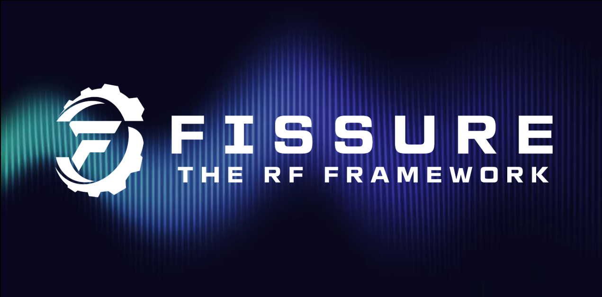

<div id="introduction"/> 

## Introduction

If you are interested in getting into the world of RF (radio frequency), or if you are already there, you should download FISSURE: the open-source RF and reverse engineering framework available on GitHub. It contains a massive list of software tools and reference material and is continuously expanding its capabilities. For instance, a recent update introduced the ability for FISSURE to deploy remote sensor nodes, which can interactively execute playlists of RF effects or be run autonomously to respond to various types of triggers. This article is the first in a series exploring the inner workings of FISSURE, showcasing its capabilities both as a powerful reverse engineering tool and as a versatile remote RF asset for real-world applications.

In this installment, we’ll focus on the reverse engineering aspect. Instead of listing all the features of FISSURE, we will first cover a reverse engineering example against an RF protocol and then explore where future automation of FISSURE could eventually take it a step further. By walking through a practical example—reversing the Z-Wave protocol between my smart light bulb and its USB controller—we will see just how quickly and effectively FISSURE can break down a protocol. In fact, it can be reverse engineered in just a few hours and someday even faster after more development.


<div id="monitoring"/> 

## Monitoring

Z-Wave is a home automation protocol used by smart home enthusiasts and in IoT applications. Although other IoT protocols have been gaining more traction, Z-Wave has been around for a while. We know going into this process that Z-Wave operates in the sub GHz range somewhere around 800/900 MHz depending on the country it is used in. Our first step in understanding this light bulb and its remote USB controller is figuring out where the frequencies are and what type of traffic we should be expecting between the two nodes.

We can use FISSURE to launch RF inspection flow graphs built using GNU Radio to get a feel for the signal timing and modulation type. Using a commercial software-defined radio (SDR), we can reposition the antenna to better understand which signals belong to which emitter based on the signal strength. By looking at the following inspection flow graphs we can see that the frequency is around 916 MHz. The larger amplitude messages originate from the controller while the weaker signals are from the light bulb.

There is frequency modulation with a synchronization period at the front of the message and data located at the end. There appears to be acknowledgment frames following every message from each node and continuous traffic being generated while the color adjustment page is open on my Z-Wave home automation phone app (*openHAB*).

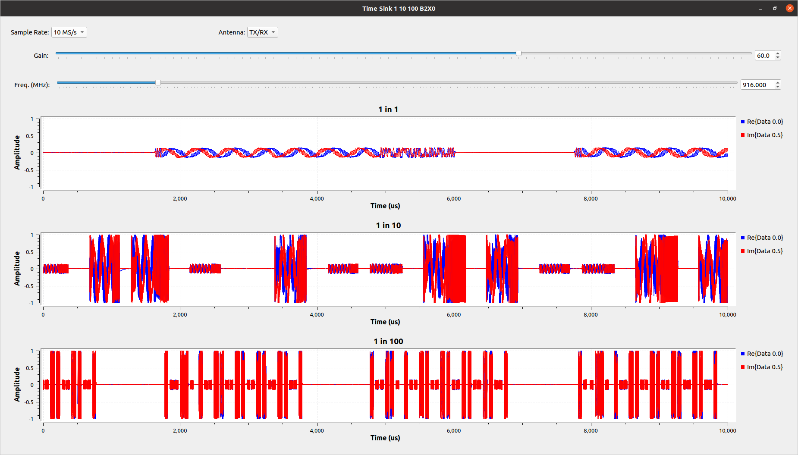

*Time Domain View*

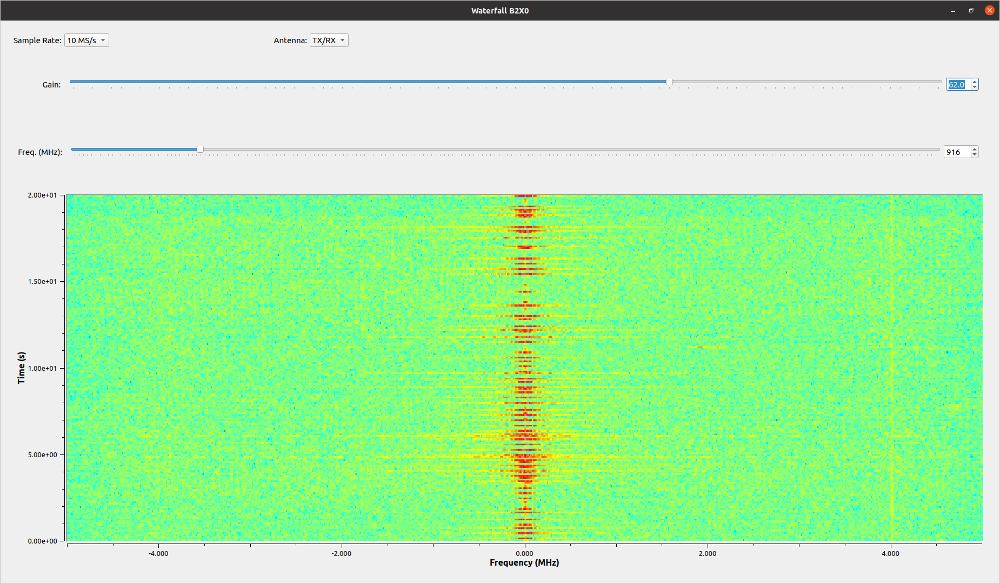

*Waterfall View*

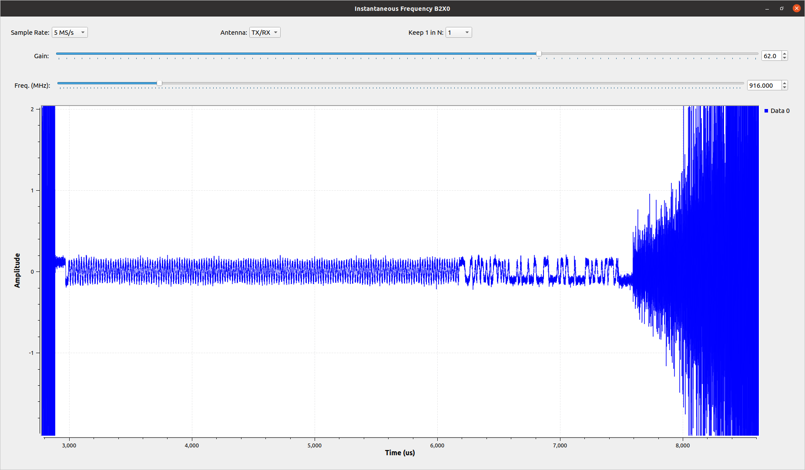

*Instantaneous Frequency View*

In the future if we want to simplify the collection of frequency, power, and timing information as part of a more automated process, we can use FISSURE’s “Target Signal Identification - Detector” tab. This will let us set up search bands or sit on a fixed frequency and record readings for signals above an amplitude threshold. FISSURE provides an interface to swap out techniques for many of its processes. So if one day we wanted to improve the detector by utilizing faster spectrum scanning tools like *hackrf_sweep* or *rtl_power* we could insert it as a new option. Additionally, we can support other customizations such as adjusting the detector filtering method to something other than amplitude to better cater to an RF environment or to lock onto a particular target of interest.

<div id="collection"/> 

## Collection

Recording the signals to a file will help speed up our analysis of the Z-Wave protocol. Recordings are easier to work with rather than exclusively relying on live data. When collecting signals, we aim to capture known behaviors—especially if we can control the test device, such as changing the light bulb's color, turning it on or off, or adjusting its brightness.

With FISSURE, we can record signals for each action independently or we can collect large streams of data containing multiple actions and then break them into pieces afterwards. The “IQ Data” tab will also let us record multiple files of a fixed size back-to-back. Recording multiple files is useful if you want to avoid large file sizes and prefer a hands-free solution, such as when collecting signals with a laptop while driving. FISSURE can also record IQ files along with SigMF metadata supplemented by user input to prevent data ambiguity and make the data easier to redistribute.

We can view the recordings in FISSURE’s built-in IQ data viewer and verify we captured our suspected signals of interest in their entirety and did not cut off either end of our message sequence. We can also see if we recorded too weak of an amplitude or conversely too strong so that the signal becomes distorted or clipped. We do not want to lose any data from the message, as stronger, unsaturated signals are easier to work with when doing signal processing. In our Z-Wave example, we will focus on the signals coming from the Z-Wave USB controller since they contain the signals to influence the light bulb.

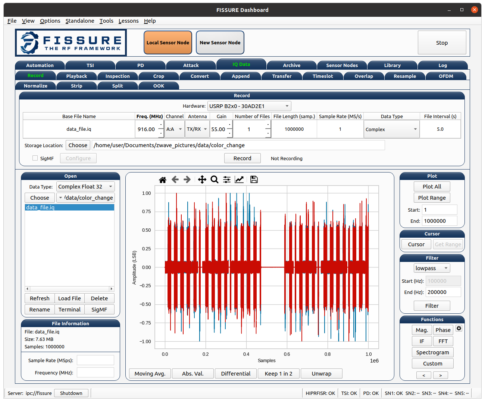

*Z-Wave Data Recording Containing Multiple Messages*


*Z-Wave Data Recording Containing Multiple Messages: Zoomed In*

A soon-to-be introduced process in which FISSURE will automate collection will be with the “Target Signal Identification (TSI) - Signal Conditioner” tab. This tab will eventually have SDR support (currently only works with prerecorded IQ files) to capture signals and slice them into smaller files using configurable isolation techniques that can be swapped out by the user. Currently, the example techniques are limited to various types of amplitude thresholds but new isolation/separation techniques could include imagery, eigenvalues, matched filters, and cyclostationary processing.

<div id="replay"/> 

## Replay

Signal replay will help us isolate our recorded signals and teach us more about the Z-Wave protocol. FISSURE has a built-in playback mechanism right in the “IQ Data” tab where a user can transmit signals from the recorded IQ file with only a few clicks. Using FISSURE’s IQ data viewer we can also zoom, select sample ranges, and crop files to isolate only the signals that produce the intended effects. In these two pictures we are isolating the color change message using the playback and crop tools.

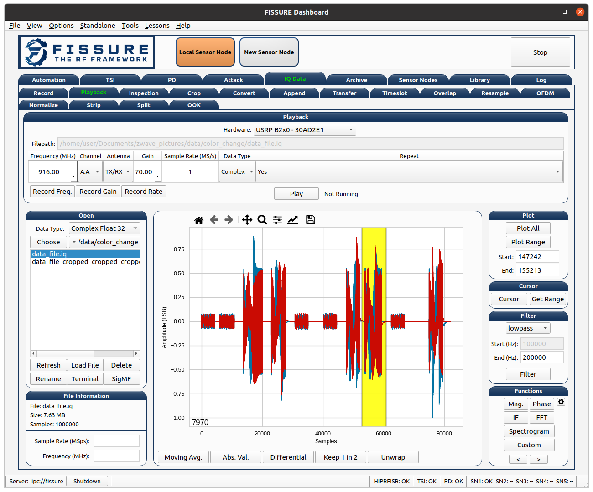

*Isolating the Z-Wave Color Change Message*

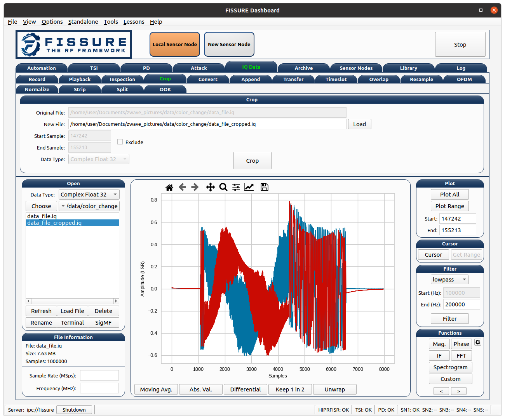

*Isolated Color Change Message after Cropping*

After replaying several of the saved messages, one can see the light bulb continue to change colors and ascertain that there is likely no timestamps/counters/sequence numbers in the message or any other elements that change over time. This is a good indicator that the protocol will not have many security layers and be a lot easier to reverse. When we go to generate our own custom signals later in the process, we’ll have a collection of ground truth to compare it against. These files can also be added to the FISSURE online signal archive to help others with simulation and building training data for developing machine learning models for reasons like RF protocol classification.

<div id="analysis"/> 

## Analysis

To make sense of the bits in the messages and prepare for signal demodulation we need to take a closer look at the properties of the signal. The IQ data viewer will let us zoom in and apply transformations to detect amplitude, frequency, or phase modulation. We can also look for other pieces of information such as:
- Detecting a synchronization window at the start of the signal
- Measuring for evidence of timeslots
- Confirming the modulation type using the instantaneous frequency
- Looking for recurring patterns between messages
- Observing the presence of a cyclic redundancy check (CRC)
- Checking if there is obvious encoding or spread spectrum techniques
- Measuring frequency deviation for 1’s and 0’s
- Finding the symbol rate
- Looking for signs of scrambling or data whitening

One of the benefits of FISSURE is its ability to quickly load IQ files into third-party analysis tools like *Inspectrum*, *Gqrx*, *IQEngine*, or *Universal Radio Hacker*—sometimes with just a single click. The instantaneous frequency and FFT measurement tools applied to the Z-Wave signal show us there is only 2-level FSK containing a frequency deviation near the expected level of 58 kHz. By measuring the fastest bit transition we can find the bit rate to be 100 kbit/s. There is no Manchester encoding or scrambling being applied because there are long stretches of 1’s and 0’s visible in the message. Observing similar messages that change the light to different colors reveals many common bits in the data portions following the preamble section. There appears to be a CRC at the end of each message because the last two bytes differ significantly for only slight changes in RGB values.

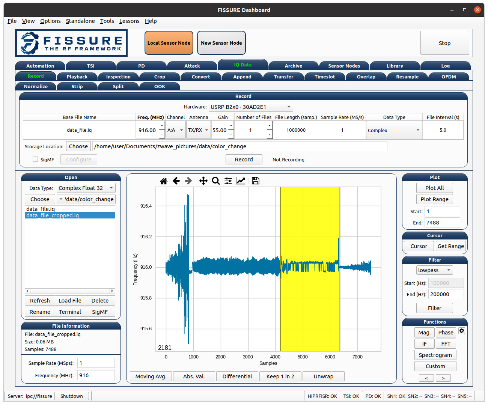

*Data Portion of the Message – Instantaneous Frequency View*

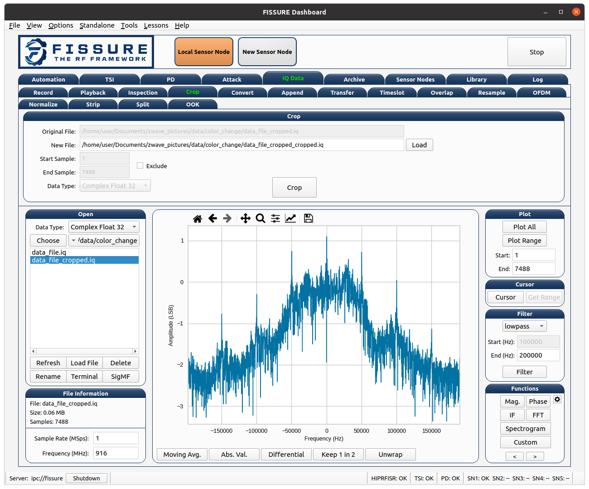

*FFT View of the Message*

These signal observations could someday be obtained automatically by executing a collection of algorithms. A prime location to do these actions is in FISSURE’s “TSI - Feature Extractor” tab which currently analyzes isolated signals and produces a bevy of statistical features. These features can be used in machine learning for classification but also be passed on to FISSURE’s next main component: “Protocol Discovery.” The Protocol Discovery component is still a work in progress, but one day will be in charge of using the signal information to make semi-automated decisions on how to demodulate the signal into a bitstream. For example, if the features provide enough confidence to classify the signal as a known protocol then a demodulation flow graph in the FISSURE library can be loaded immediately to obtain the bits. If confidence is low, the signal can be treated as unknown, and further techniques can be applied to gather signal parameters for potential demodulation.

<div id="research"/> 

## Research

At this point in the reverse engineering process, research is helpful to verify the analysis and address any holes in your understanding of the protocol. You can also check for any existing tools or algorithms that have been developed by others and determine how they can be leveraged to verify your results as you develop transmit and receive capabilities. There may also be standards or documents that detail required specifications for multiple layers of the OSI model for that protocol. A good place to start is with the FCC ID, often found on the device itself, where you can find the expected frequency and bandwidth information from the test reports and also view chip information from internal photographs. The chips may also have datasheets or application notes associated with them that contain details about specific implementations of the protocol.
While some Z-Wave research has already been performed in determining the possible frequency channels, data rates, and other signaling information, more needs to be learned about the data structure and content for the messages. A quick internet search for “Z-Wave specification” yields the Silicon Labs command class specification which describes the types of commands and frame formats for each message. There are additional specifications available from the Z-Wave Alliance that go into the physical and MAC layers in some detail. However, keep in mind there are different versions of Z-Wave such as original Z-Wave, Z-Wave Plus (Gen5), Z-Wave Long Range (Z-Wave LR), and Z-Wave 800 Series. Each can have separate parameters and sequences for key areas like preambles, start frame delimiters, data field ordering, security, and CRC calculation.

Our messages from the Z-Wave controller to the light bulb line up with the original Z-Wave specification because the start frame delimiter values and frame control location are different than what is listed in the newer documents. We can also lock down the CRC as having a seed of “0x1D0F” and a polynomial of “0x1021.” These values can be used to confirm the validity of our bitstream analysis and to develop transmit/receive code later on. Our recorded messages should follow this format for a data frame, as outlined in the specifications—which we will soon confirm:
- Preamble
- Start Frame Delimiter
- Home ID
- Source Node ID
- Frame Control
- Length
- Destination Node ID
- Command Class
- Command
- CRC

A command of particular relevance found in the specification is the “Color Switch Set Command” which seems like an obvious match for the signals that were recorded to change the colors of the light bulb. Other relevant commands for interacting with the light bulb include “Multilevel Switch - Off” and “Multilevel Switch - On” which were also recorded.

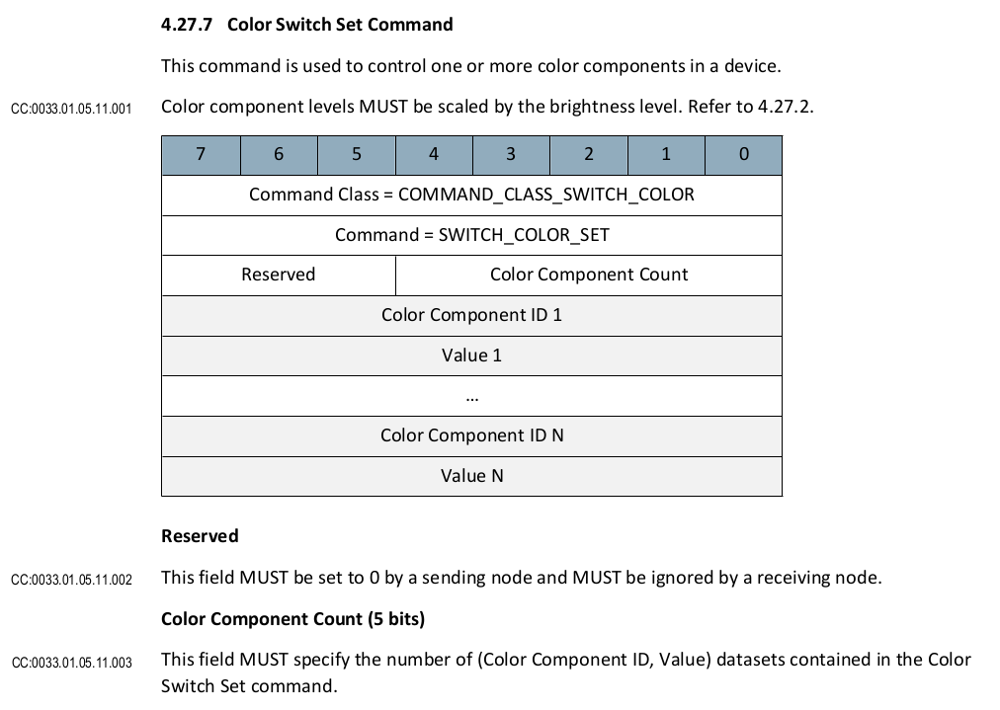

*Color Switch Set Command Format Found in the Z-Wave Specifications*


*Color Component ID Format Found in Z-Wave Specifications*

Now we have to confirm if the bits in the recorded messages will plausibly fit into the expected message format. Searching GitHub for Z-Wave SDR tools yielded several results. The most helpful tool was *baol/waving-z*, a fork from *andersesbensen/rtl-zwave*. I used an RTL dongle to run the *waving-z* tool in a terminal and listen to my recordings that were transmitted from another SDR using FISSURE. The tool printed out data fields consistently for the first half of each message but would always drop a bit in the middle of each message. It was not consistent enough to line up to the specification, but it was close in length to know that we are on the right track.

A couple example bitstreams to work with would be helpful in developing our own tools. Obtaining the bits could be performed manually in a somewhat tedious process by eyeballing the instantaneous frequency and picking out the 1’s and 0’s. A better option is to use a tool like *Universal Radio Hacker* in conjunction with FISSURE’s “PD - Data Viewer” tab. Taking a recording of our signal at 1 MS/s and setting the modulation type in *URH* to FSK with 10 samples/symbol (which equates to 100 kbps as pulled from the specifications) will produce the entire bitstream for us. Keep in mind, the bit accuracy could be slightly off if the sampling and synchronization with our signal is not perfect. Fortunately for us it appears to be perfect and the bits can be copied from *URH* over to FISSURE, inverted so the lower frequency is treated as a 1, shifted slightly in bit positions by deleting the leading bits, and then converted to hexadecimal to produce values that look like this:
```
0xFC55555555555555555555555555555555555555555555555555555555555555555555555555555555F0FA1C0B48014108180233050500000100025D03FF040043B200000000000000000000000000

0xFFC55555555555555555555555555555555555555555555555555555555555555555555555555555555F0FA1C0B4801410D18023305050000010002FF0306040258220000

0xFFC55555555555555555555555555555555555555555555555555555555555555555555555555555555F0FA1C0B480141070E0226016322220039292AD194F99290917333145B37EB029EB9F

0xFC55555555555555555555555555555555555555555555555555555555555555555555555555555555F0FA1C0B480141080E02260100BBE40000
```

These four messages (“Green,” “Red,” “On,” and “Off”) can be truncated and spliced according to the fields defined in the Z-Wave specifications. The highlighted data regions can then be used to confirm the CRC values in each message using FISSURE’s “PD - CRC Calculator” tool:
- 0x55 F0 **FA1C0B48 01 4108 18 02 33 050500000100025D03FF0400** 43B2
- 0x55 F0 **FA1C0B48 01 410D 18 02 33 05 050000010002FF03060402** 5822
- 0x55 F0 **FA1C0B48 01 4107 0E 02 26 0163** 2222
- 0x55 F0 **FA1C0B48 01 4108 0E 02 26 0100** BBE4

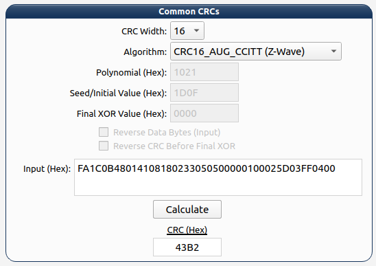

*FISSURE CRC Calculator Tool Verifying the CRC Value from the Data Payload*
    
<div id="demodulation"/> 

## Demodulation

We have acquired enough protocol information to construct a GNU Radio flow graph capable of performing live demodulation for these types of Z-Wave signals. Additionally, we are well-positioned to develop solutions for other Z-Wave variants, should more test devices become available in the future.

FISSURE includes numerous example flow graphs that demonstrate methods for demodulating signals across a variety of RF protocols. It also provides flow graphs from popular third-party software tools for reference. In GNU Radio Companion, a straightforward approach for decoding burst-transmitted signals involves using an amplitude threshold to tag the start and end of a message. A custom decoder block can then process the instantaneous frequency of an FSK signal to generate a bitstream and display readable messages.

The flow graph below shows the burst tags being applied to a smoothed out magnitude envelope of the signal. The “Quaderature Demod” block produces the instantaneous frequency that is passed through a moving average filter and converted to 1’s and 0’s using the “Threshold” block. One in every ten samples is kept to account for the 1 MS/s to 1 kbps decimation and then the bits are fed into the custom decoder that looks for the burst tags and start frame delimiter. There is no synchronization with the preamble or accounting for drift in this approach so some messages may contain faulty data. Messages with valid CRC values can be printed to the screen while corrupted messages are discarded. This flow graph can be modified and its parameters adjusted to improve receive performance by using our signal recordings and replacing the “UHD: USRP Source” block with a “File Source” block.

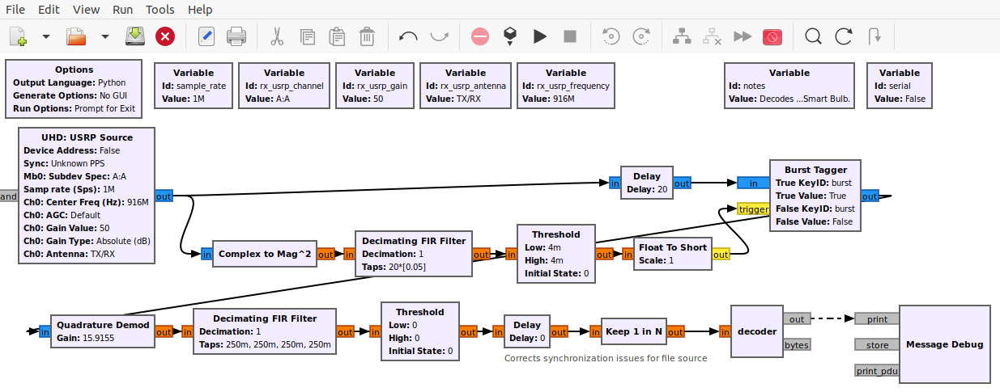

*Z-Wave Receive Flow Graph*

```
Message #283:
Bitstream: 11111010000111000000101101001000000000010100000100001000000110000000001000110011000001010000010100000000000000000000000100000000000000100101110100000011111111110000010000000000010000111011001010000000000000
Full Hex: FA1C0B48014108180233050500000100025D03FF040043B2
Home ID: 0xFA1C0B48
Source Node ID: 01
Frame Control: 4108
Length: 18
Destination Node ID: 02
Command Class: 33
Command: 050500000100025D03FF0400
CRC: 43B2
Calculated CRC: 43B2
```

*Example Flow Graph Output Printed to Terminal*

Now that we have a partial receive solution, we can expand our knowledge of the Z-Wave protocol and augment FISSURE’s Z-Wave capabilities in several areas. To begin, we can capture additional command types exchanged between the controller and the light bulb, reference them in the specification, and build a deeper understanding of the traffic for various operations. Frequently-used message types can be added to the FISSURE “Attack - Packet Crafter” tab as they are uncovered to help construct new messages at the bit-level and help maintain a collection of message formats for future reference.

This receive flow graph can be modified to support more types of SDRs and be integrated into FISSURE so it can be run with just a few clicks. The “PD - Demodulation” tab can be used to run a demodulation flow graph and pipe the bits into a circular buffer for pattern analysis and help with field delineation using the “PD - Bit Slicing” tab. Custom Wireshark dissectors could be built using FISSURE’s “PD - Dissectors” tab to make it easier to investigate and log traffic.

Hypothetically, if these Z-Wave data messages were more complicated or the protocol details were not known publicly, we could have used FISSURE to analyze the encoded bitstream and make sense out of the unknown data. As we have already partially seen, the “PD - Data Viewer” tab can shift bits, remove them, invert them, apply manchester decoding, view the results in hex, and compare them against existing packet types in the FISSURE library. The “PD - CRC Calculator” tab can process data using common CRC algorithms and perform reverse lookups to identify polynomial and seed values by using data examples with known CRC outputs.


*PD - Data Viewer Tab for Bit Analysis and Library Comparison*

In the future, the Protocol Discovery tabs will be reconfigured to automate the process of producing bitstreams for both known and unknown RF protocols. Signals of interest classified with high confidence will be immediately processed through demodulation flow graphs, with their traffic logged. For unknown signals, generic demodulation flow graphs can be applied sequentially to extract the same physical and data layer information demonstrated manually. If the protocols are too complex and automated analysis reaches a dead end, preliminary data will still be available for analysts.

<div id="injection"/> 

## Injection

The lessons learned from developing receive capabilities can be applied in reverse, progressing from constructing data fields in commands to calculating CRCs, adding preambles, and finally modulating bits in GNU Radio to transmit signals from SDRs. We can create individual flow graphs and blocks for transmission based on different criteria, such as sending specific commands (e.g., red, green, adjusting brightness, turning on/off), generating random colors or cycling through a predefined color list, performing generic transmissions for any Z-Wave command, or developing a fuzzer for specific packet types and data fields.

The following is an example flow graph integrated into FISSURE for transmitting generic “Original Z-Wave” commands. In the image below, a custom message generator repeats Protocol Data Unit (PDU) messages at a regular interval that can be customized through the FISSURE “Attack - Single-Stage” tab. Each PDU message is converted to a tagged stream that is modulated using physical layer parameters that can be obtained from the specification or adjusted to help maximize reception at the target. There is a consistent delay coming from the “GFSK Mod” hierarchical block so a delay is applied to realign the tag at the start of each message. The “UHD: USRP Sink” can transmit signals in a burst mode when choosing to use a packet length tag and the Time-Speculative Burst (TSB) field of the block. This TSB method does not require a continuous stream of data which is typically required for other types of SDR sinks. While easier to implement and not requiring the SDR to be transmitting continuously, the drawback is it is more work to convert the flow graph and custom blocks to support other types of hardware.

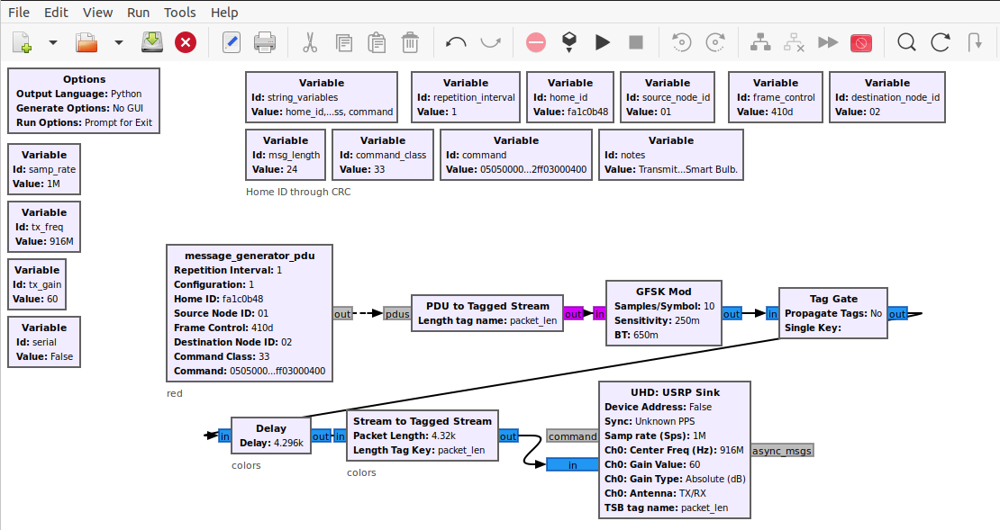

*Generic Z-Wave Transmit Flow Graph*

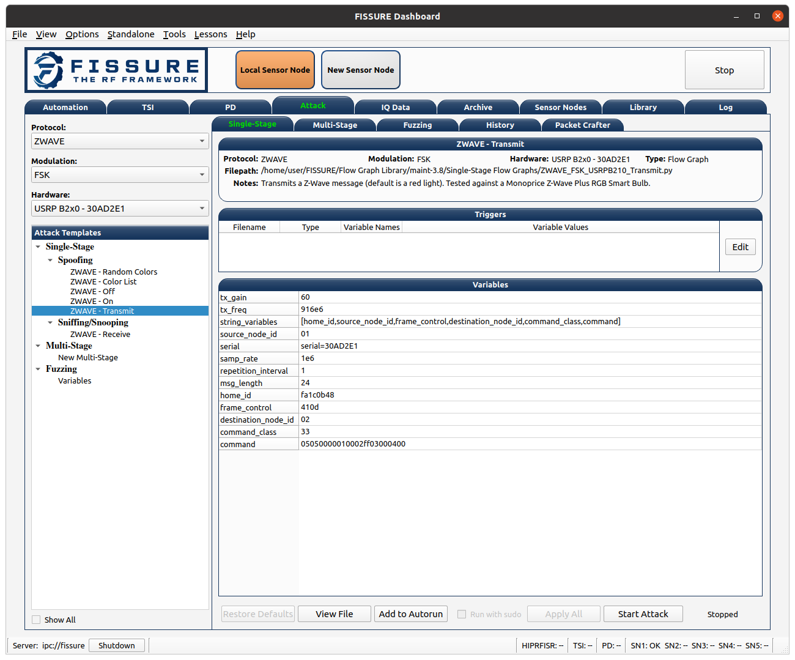

*Attack - Single Stage Tab for Quickly Executing the Flow Graph*

While the previous sections outlined steps for future automation, dynamic construction of transmission flow graphs is not an immediate goal for FISSURE. Although developing transmit capabilities for the Z-Wave protocol demonstrates the feasibility of dynamic transmission, prioritizing controlled responses often proves more advantageous due to various factors. There are many risks to transmitting without user interaction in the form of accuracy, compliance, and performance that need to be weighed for every RF environment. Future FISSURE attack development will focus on expanding the FISSURE library of scripts/flow graphs, improving the fuzzing capabilities, and tying the transmission and receive capabilities together to build out a vulnerability analysis profile for a target.

<div id="vulnerability_analysis"/> 

## Vulnerability Analysis

The final stage in the RF reverse engineering process is vulnerability analysis. We developed transmit and receive capabilities that allow us to fully communicate with the target. Now we can test the device to see its limitations and expand our reach to other devices, targets, and networks. For our Z-Wave example, we can push the light bulb to its limit to see how fast it can change colors, determine which messages cause it to become unresponsive, find what it takes to force it synchronize to another device, extract security keys or bypass encryption, pass data to other nodes on the network, check what happens when a length field is overextended or if naughty string injection occurs in certain fields to produce an unintended effect, or run through a list of any known zero-days or CVEs. In the future, FISSURE will allow the user to choose which of these options to execute or use advanced fuzzing methods to discover new vulnerabilities.

<div id="conclusion"/> 

## Conclusion

In this article, we explored FISSURE as a powerful RF reverse engineering tool, delving into concepts that originated from something as fundamental as communicating with a light bulb. While there is still considerable room for development in automating FISSURE and enhancing manual operations, it stands out as an excellent project for understanding the intersection of RF and cybersecurity, as well as for encouraging engagement in its ongoing development. In the next article we will reverse engineer signals from a ceiling fan remote and highlight more FISSURE tools that were not covered here. After that, the focus will shift towards practical examples that demonstrate how to leverage FISSURE as an operational tool for executing complex tasks.

FISSURE is an open-source project maintained by Assured Information Security, Inc.

Learn more at:
- https://github.com/ainfosec/FISSURE
- https://ainfosec.com/fissure
- https://github.com/cpoore1/gr-zwave_poore
